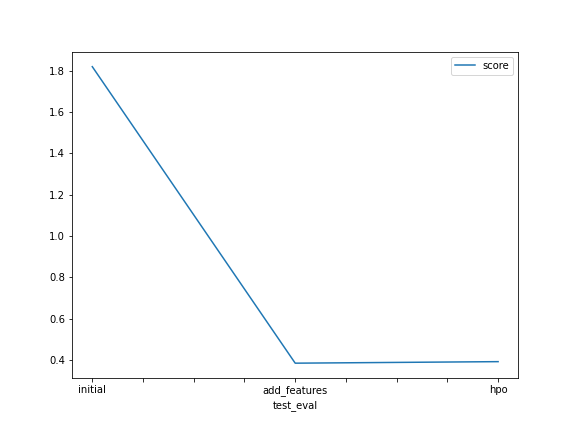

# Report: Predict Bike Sharing Demand with AutoGluon Solution
#### Yves D'hondt

## Initial Training
### What did you realize when you tried to submit your predictions? What changes were needed to the output of the predictor to submit your results?
The predictions needed both the datetime and the value for the count prediction in the CSV file.
Next to this, the prediction for the count needed to be >= 0.

### What was the top ranked model that performed?
The second model, i.e. with feature engineering, but without hyper parameter tuning.

Changing the high-level parameters of the AutoGluon TabularPredictor did not improve the Kaggle score, but it did
improve the training score displayed by AutoGluon.

## Exploratory data analysis and feature creation
### What did the exploratory analysis find and how did you add additional features?
There were a number of things.

First, `season` and `weather` were changed into categorical variables as they were clearly mistreated as numerical variables.

Furthermore, some variables showed a very skewed distribution. Specifically `count` and `windspeed`.
A log-transformation was applied to them to give them a more bell-shaped distribution which might train more easily.

Next to this, the datetime was deconstructed into `year`, `month`, `day_of_week`, and `hour` variables.
The `year`, `month`, and `day_of_week` variables are treated as categorical variables.
`day_of_week` here consists of 7 values to represent Monday through Sunday.

Regarding the `hour` variable, the first 4 values (0, 1, 2 & 3) were changed to 24, 25, 26 & 27 so the entire distribution would be more bell-shaped.
Next to this, during the hours 7-8 and 17-18 on weekdays that are not holidays, there are clear peak-hours in the count.
Therefore, two dummies were constructed to represent these morning & evening peak hours, respectively.

Finally, all remaining numerical variables were scaled using a StandardScaler fitted to the relevant training data.

### How much better did your model preform after adding additional features and why do you think that is?
The model performed a lot better. According to Kaggle, the RMSLE went down from 1.8197 to 0.38512.

Looking at what we found during the EDA there seem to be a number of reasons.
First of all, the log-transformed distribution of the `count` variable made it easier to train on.
Next to this, `season` and `weather` were not treated correctly in the baseline model.
Furthermore, there is a clear relationship between `hour` & `count` so adding the `hour` variable likely helped.
On top of that, the clear presence of peak-hours is now also represented in the model.

## Hyper parameter tuning
### How much better did your model preform after trying different hyper parameters?
The model performed a little bit better according to the AutoGluon output. The tuned model had an
RMSE of -0.127174 while the un-tuned model had an RMSE of -0.129765. However, according to the Kaggle score, the
un-tuned model performed a little bit better with an RMSLE of 0.38512 vs an RSMLE of 0.39251 for the tuned model.

Overall, the performance gains of the model are debatable at best and as good as negligible.

### If you were given more time with this dataset, where do you think you would spend more time?
Creating separate models for the `casual` and `registered` counts would be a good first step in my opinion.
There could be different drivers behind the two customer segments. Perhaps `registered` users are more sensitive to peak hours
(e.g. if it is their daily choice of commuting method) while `casual` users could be more sensitive to weekends or holidays.

I already created two models for this purpose by re-using the second model (un-tuned, with feature engineering) and 
simply changing the target variable. From that, it seemed like the model performed better on the `registered` users
and worse on the `casual` users.

Next to this, looking more into the time-series effects could be interesting. If there was strong growth between the years
or months on which we have data, this might not be captured well enough by simply adding some time fixed-effects to the model.

Finally, right now I just changed some of the hyperparameters of the AutoGluon TabularPredictor itself. Limiting the framework
to only work with one model at a time could be helpful to better understand which models work well for this dataset. From
that point on, we could limit the framework only to those few models that seem to work best and then do some more in-depth
hyperparameter tuning for those specific models.

### Create a table with the models you ran, the hyperparameters modified, and the kaggle score.
```python
    "model": ["initial", "add_features", "hpo"],
    "hpo1": ["presets=\"best_quality\"", "presets=\"best_quality\"", "presets=\"best_quality\""],
    "hpo2": ["time_limit=600", "time_limit=600", "time_limit=1200"],
    "hpo3": ["", "", "auto_stack=True"],
    "hpo4": ["", "", "hyperparameter_tune_kwargs=\"default\""],
    "hpo5": ["", "", "hyperparameters={\"GBM\": {}, \"CAT\": {}, \"XGB\": {}, \"FASTAI\": {}, \"RF\": {}, \"XT\": {}}"],
    "training_score": [-50.522805, -0.129765, -0.127174],
    "kaggle_score": [1.8197, 0.38512, 0.39251]
```

|model|hpo1|hpo2|hpo3|hpo4|hpo5|score|
|--|--|--|--|--|--|--|
|initial|presets="best_quality"|time_limit=600|/|/|/|1.8197|
|add_features|presets="best_quality"|time_limit=600|/|/|/|0.38512|
|hpo|presets="best_quality"|time_limit=1200|auto_stack=True|hyperparameter_tune_kwargs="default"|hyperparameters={"GBM": {}, "CAT": {}, "XGB": {}, "FASTAI": {}, "RF": {}, "XT": {}}|0.39251|

### Create a line plot showing the top model score for the three (or more) training runs during the project.


### Create a line plot showing the top kaggle score for the three (or more) prediction submissions during the project.




## Summary
Clearly, the data cleaning and feature engineering had a much bigger impact than the changes to the hyperparameters of the AutoGluon.
This intuitively makes sense as we can discover and lay bare a lot of relationships in the data that the models might not easily pick up themselves.
Those can be really big changes such as clearly defining peak-hour relationships or correctly handling categorical variables.
The hyperparameter tuning on the other hand, is more looking for marginal improvements to the model, given that the un-tuned model already had a really low RMSE.
Next to this, the fact that the performance of the model did not change tremendously between fine-tuning and separately predicting the casual and registered counts,
also reinforces the robustness of the models.
